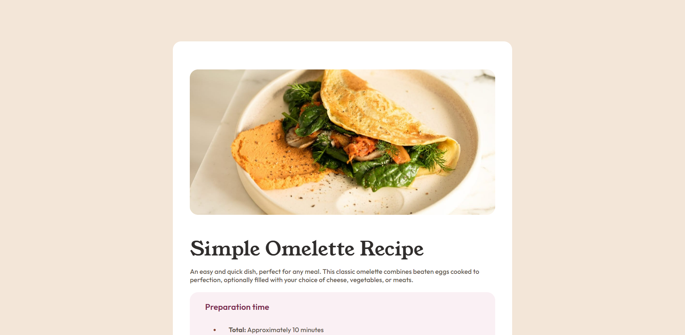
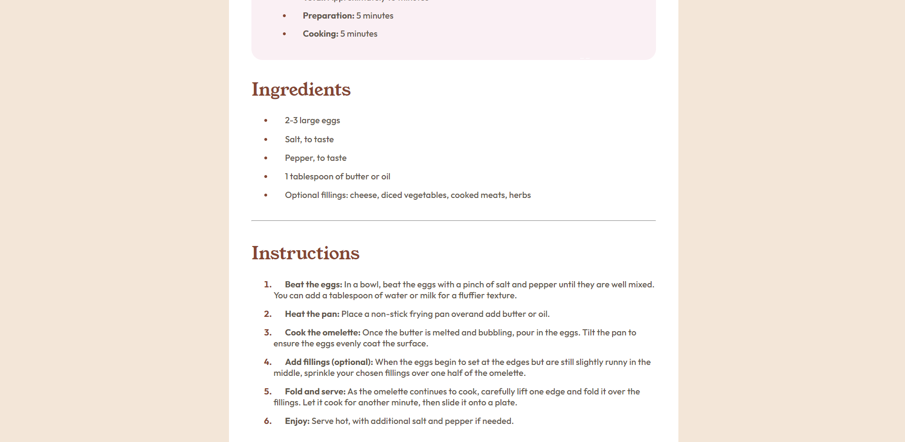
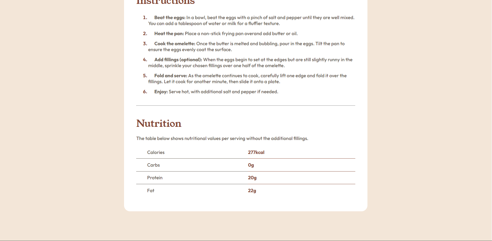

# Frontend Mentor - Recipe page solution

This is a solution to the [Recipe page challenge on Frontend Mentor](https://www.frontendmentor.io/challenges/recipe-page-KiTsR8QQKm). Frontend Mentor challenges help you improve your coding skills by building realistic projects. 

## Table of contents

- [Overview](#overview)
  - [The challenge](#the-challenge)
  - [Screenshot](#screenshot)
  - [Links](#links)
- [My process](#my-process)
  - [Built with](#built-with)
  - [What I learned](#what-i-learned)
  - [Useful resources](#useful-resources)
- [Author](#author)

## Overview

### Screenshot

Following are the screenshots of the webpage:
  
  
  

### Links

- Solution URL: [Add solution URL here](https://your-solution-url.com)
- Live Site URL: [Add live site URL here](https://your-live-site-url.com)

## My process

### Built with

- Semantic HTML5 markup
- CSS custom properties

### What I learned

In this project, I devoted my time to create the webpage with HTML and CSS. I focused on using relative units to centre divs or other positioning works rather than using absolute units entirely as I used to do earlier. This has made the webpage more efficient and  responsive.

### Useful resources

- [Stack Overflow](https://stackoverflow.com/questions/40895914/create-table-with-only-bottom-border-in-html)
- [Shecodes](https://www.shecodes.io/athena)
- [W3schools](https://www.w3schools.com/cssref/css_units.php)

## Author

- Frontend Mentor - [@SaxenaAmogh](https://www.frontendmentor.io/profile/SaxenaAmogh)
- Twitter - [@amogh11saxena](https://twitter.com/amogh11saxena)
- Github - [SaxenaAmogh](https://github.com/SaxenaAmogh)
